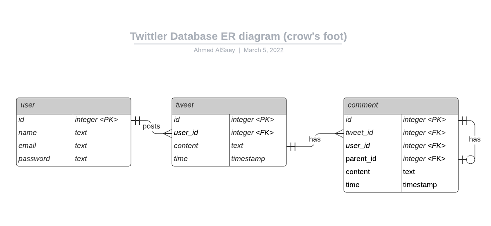
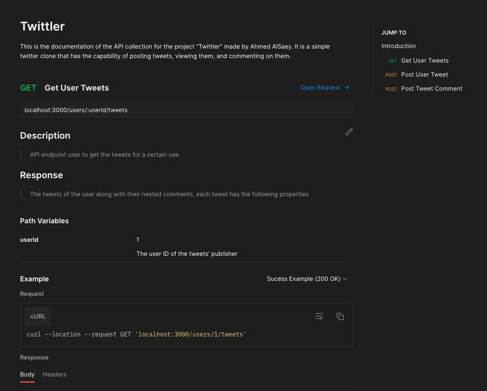

# Twittler

A NodeJS (TypeScript) Twitter clone API that allows the user to posts tweets, fetch tweets of a certain user, and comment on tweets.

## What to lookout for

I have tried to write this repository as cleanly as possible, so I thought you would like to lookout for these:

- Unit tests with Jest (Not exactly exhaustive, but I have given an example to how they work in this repository)
- Clean code architecture (Multiple layers, dependency injection, inversion of control, etc.)
- Layered error handling and properly formatted errors (Error codes, consistent messages, etc.)
- Using JSDocs for code documentation and commenting
- Linting and formatting using ESLint and Prettier
- Pre-commit hooks for linting and formatting
- Database ERD
- Postman API documentation included

## Prerequisites

- Docker (For launching a local PostgreSQL container, if you don't have PostgreSQL installed)
- Node & NPM
- Postman (For importing the API documentation)

## Setup

- Clone the repository
- Install dependencies

```bash
npm install
```

- Rename the `.env.example` file to `.env` and add your database credentials, if you wish to use the default database configuration for this repository, move to the next step.
- Initialize database docker image, this will launch a local Postgres docker image that works with the variables that are in the .env example file, you can use your own custom credentials though.

```bash
npm run start-db
```

- If you want, you can run test using the following command

```bash
npm test
```

## Usage

To start the server locally, use this command:

```bash
npm start
```

After that, the server withh start on localhost port 300, where you can send HTTP requests to. See the API documentation below for more on that.
Don't worry about setting up the database schema, the code itself initializes it on the first run.

## Understanding the code

The code might seem complex at first, but it is built using [clean code architecture](https://blog.cleancoder.com/uncle-bob/2012/08/13/the-clean-architecture.html), where the code is essentially divided into circular layers, where the outermost layers can depend on the innermost layers, but the opposite is not true.
These are some of the principles that I kept in mind (from the [SOLID principles](https://www.digitalocean.com/community/conceptual_articles/s-o-l-i-d-the-first-five-principles-of-object-oriented-design)):

- **Single responsibility**: As you will see in the code, the code is divided into layers, where each layer has a distinctive role that it should assume. For example, the model layer contain the types and entities for our code, the repository layer is the data access layer to the PostgreSQL database, the use case layer is where most of the business logic and input validation (using business rules) happens, and the controller layer is responsible for mapping the incoming (outside) input to the input that the use case expects.
- **Interface Segregation Principle**: This can be seen where we create a specific interface for the database that the repositories depend on, where only the query function is exposed, instead of the entire database interface of out PostgreSQL framework.
- **Dependency Inversion Principle**: This is the most important point in my opinion. Every dependency from a different layer in those code is on an interface, not a concretion. And it is injected to the layer through function parameters. This allows decoupling of layers, and allows us to easily modify our code, without modifying the dependents of it (Instead of modifying the dependents, we adapt the new code to the interface that the dependents depend on). This also allows us to easily test the code as seen by the unit tests in this code. Since all modules are decoupled and depend on interfaces, we can easily test a module by mocking its dependencies, and adapting to the interface of the module (For example, building a fake database for testing.

Other principles do not exactly apply to our code since we mostly use functional programming, not OOP.

To navigate the code, start with `src/index.ts` file, from there, you will see that it imports controllers to use in as express middlewares, these controllers use use cases, and the use cases use repositories (Controller > User Case > Repository). All of these layers are initialized with their dependencies injected in their corresponding `index.ts` file, where they are exported after initialization.

## Documentation

In this repo, you will find the ERD of for the database used in this code as a PNG image, similar to the image below:


You will also find a postman collection file (ending with .postman_collection.json) in this repository, you can import this collection, where you can [find the documentation of the API endpoints](https://learning.postman.com/docs/publishing-your-api/viewing-documentation/)

Example:


## License

[MIT](https://choosealicense.com/licenses/mit/)
